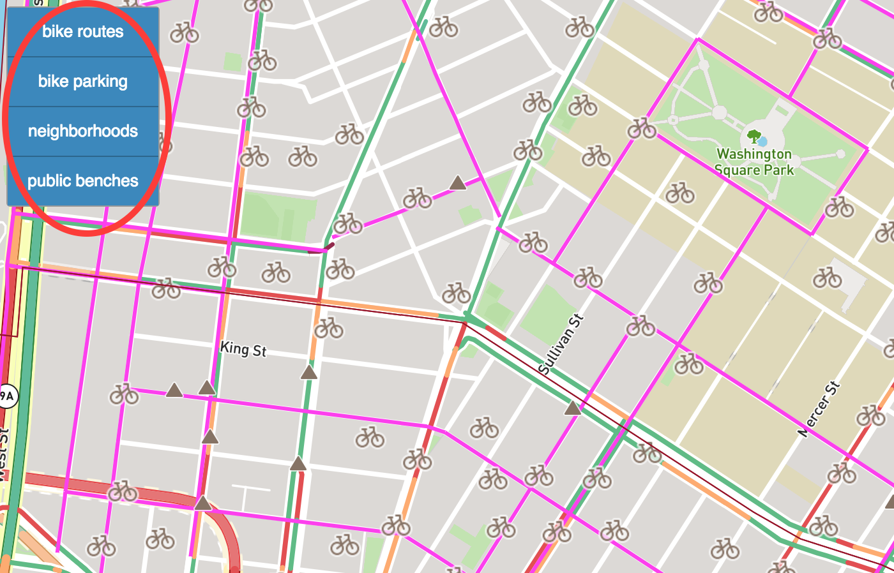
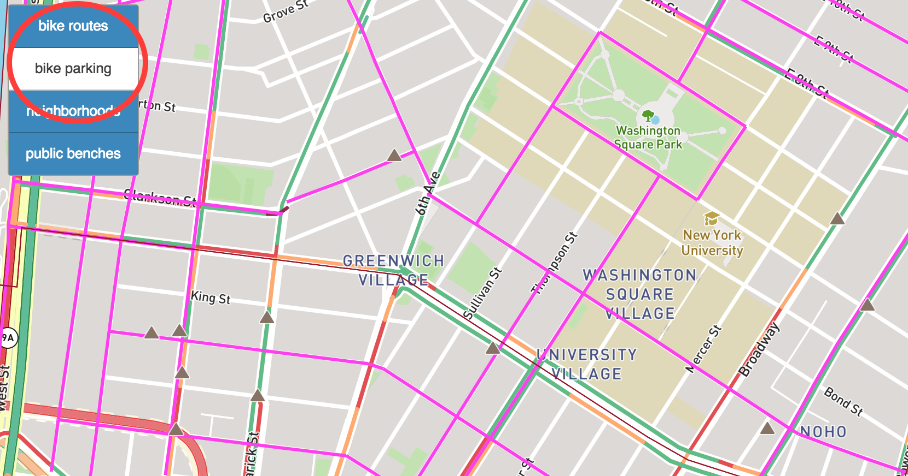

# NYC Map for Cyclist and Pedestrians
A map containing granular local information rarely found in commercial maps.

[Check it out](https://elainechan.github.io/mapping/)
## Current Features
- Displays on load, toggles on button click:
	- Bike parking locations
	- Bike routes
	- Public benches locations
	- Neighborhood boundaries
- Displays popup with location information on symbol click.
- See [notes](https://github.com/elainechan/mapping/blob/master/notes.md) for copious details and sources.
## Usage
Click on a symbol to see more information about it.

Press the buttons on the upper left corner to show or hide features.

## Main Tools
- [NYC Open Data](http://www.nyc.gov/html/dot/html/about/datafeeds.shtml#bikes)
- [Mapbox GL JS API](https://www.mapbox.com/mapbox-gl-js/api/)
- [Bootstrap](https://v4-alpha.getbootstrap.com/components/modal/)
## Process
- Data is downloaded manually from NYC Open Data and uploaded to Mapbox Studio to create custom vector tiles.
- To create the show/hide features effect, the code uses Mapbox API to render a map and retrieve the custom vector tiles as layers upon the map.
## Examples Used
- [Show and hide layers (Mapbox)](https://www.mapbox.com/mapbox-gl-js/example/toggle-layers/)
- [Bootstrap modal plugin](https://www.w3schools.com/bootstrap/bootstrap_modal.asp)