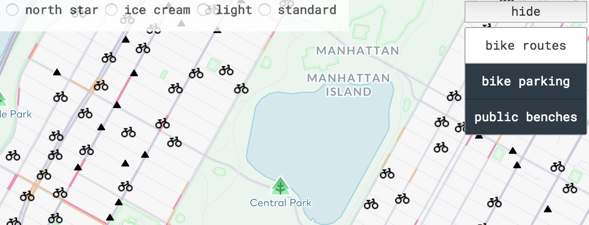

 
# Bike Me: NYC Map for Cyclists and Pedestrians
Doing my bit to make NYC more accessibly to the masses ... a map containing granular local information for biking and walking the city. This stuff is rarely found on commercial maps, at least in my experience. I'd love to know if there are other sources out there. 

Also, let me know if the app is painfully slow ... not that I can do anything about it unless I run my own server, but it's good to know I'm not alone.

# [Check it out](https://elainechan.github.io/mapping/)
## Current Features
- Toggle features: show or hide these layers by clicking some buttons:
	1. `Bike parking`: park the bike and go do something.
		- Click on a bike symbol to see the address and number of racks available at that spot.
	2. `Bike routes`: ride somewhere!
	3. `Public benches`: sit down and shu ... take a break from walking around all day.
		- Click on a triangle symbol to see the address and cross streets of the location, and whether the bench has a back or not. It's nice to lean back sometimes.
	4. `Neighborhoods`: find out what neighborhood you're in.
		- When the `Neighborhoods` layer is active, hovering over a neighborhood highlights it and prints its name in a popup box in the bottom.
- Popup information: when you click on some random symbols (subway station, schools, landmark, etc.), a dialog box appears and shows basic information. 
	- It's not particularly useful right now, but it will be after adding Twitter and FourSquare data.
- Switchable map style: click the radio buttons up top to switch to a different map style.
	- Default: the Navigation Preview Day theme, an elegant and clean navigation map layer.
	- Streets: the popular Mapbox Streets style with a good amount of navigation details.
	- Scenic: a minimalist navigation map that highlights major features for nature enthusiasts (parks, highways, etc.).
	- Standard: a retro style modeled after the Standard Oil maps.
	- Navigate: a no-nonsense navigation map that highlights roadways.
	- North Star: a nautical navigation map with ocean depth contours; looks better far out than zoomed in.
## Usage
Click on a symbol to see more information about it.

Press the buttons on the upper left corner to show or hide features.

## Main Tools
- [NYC Open Data](http://www.nyc.gov/html/dot/html/about/datafeeds.shtml#bikes)
- [Mapbox GL JS API](https://www.mapbox.com/mapbox-gl-js/api/)
- [Bootstrap](https://v4-alpha.getbootstrap.com/components/modal/)
## Process
1. Features toggle
	- Data is downloaded manually from NYC Open Data and uploaded to [Mapbox Studio](https://www.mapbox.com/mapbox-studio/) to create custom vector tiles.
	- To create the show/hide features effect, the code uses Mapbox API to render a map and retrieve the custom vector tiles as layers upon the map.
2. Switchable map styles
	- Manually selected map styles on Mapbox Studio, then uses API to retrieve styles at runtime.
## Examples Used
- [Show and hide layers (Mapbox)](https://www.mapbox.com/mapbox-gl-js/example/toggle-layers/)
- [Create a hover effect](https://www.mapbox.com/mapbox-gl-js/example/hover-styles/)
- [Bootstrap modal plugin](https://www.w3schools.com/bootstrap/bootstrap_modal.asp)
## Notes
- See [notes](https://github.com/elainechan/mapping/blob/master/notes.md) for development notes and sources.
- See [bleachers](https://github.com/elainechan/mapping/blob/master/bleachers.md) for leftover code bits that mostly worked but didn't make the cut.
- See [greenroom](https://github.com/elainechan/mapping/blob/master/greenroom) for code that's can't wait to be used for coming features.